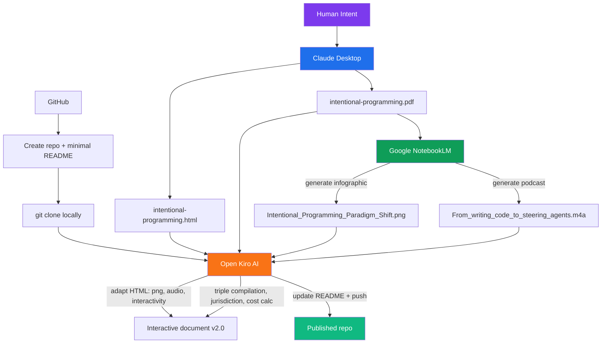

# Intentional Programming

A minimal exploration of the intentional programming paradigm — created entirely with AI tools, orchestrated by human intent.

**Author:** Dragos Boros  
**Date:** August 2025  
**Version:** 2.1

## What's in here

| File | What it is |
|------|-----------|
| `intentional-programming.html` | The main artifact — an interactive document (open in a browser) |
| `intentional-programming.pdf` | PDF snapshot for printing/offline reading |
| `Intentional_Programming_Paradigm_Shift.png` | Infographic generated by NotebookLM |
| `From_writing_code_to_steering_agents.m4a` | Podcast generated by NotebookLM |
| `html2pdf.md` | Skill guide: convert HTML to PDF using headless Edge/Chrome |
| `changes.md` | Changelog of additions made via Kiro |

## What is the HTML file?

It's both a document and a web app — and that blurriness is itself a feature of intentional programming. It started as a static article, but through iterative dialogue with AI tools it grew to include:

- An embedded audio player (podcast playback)
- An interactive cost calculator (live JavaScript)
- A playable game (guess-a-number)
- SVG data visualizations

No framework, no build step, no bundler. Just a single HTML file that crosses the document/app boundary — because the paradigm doesn't force you to decide upfront which category your artifact belongs to. You express intent, and the result is whatever best serves the intent.

## About this README

This README overlaps with a specification document — but they serve different purposes:

| | Specification | README |
|--|--|--|
| **Time orientation** | Forward-looking: "what we will build and why" | Present-tense: "what exists and how to use it" |
| **Audience** | Builder (you, your agent, your team) | Consumer (anyone who clones the repo) |
| **Contains** | Requirements, acceptance criteria, open questions | Usage instructions, context, attribution |
| **Lifecycle** | Lives during development, may become stale | Lives as long as the repo exists |

In this project they blur because the artifact *is* the content — there's no separate "app" to document. The README is the entry point for humans; the HTML is the entry point for browsers.

## On artifacts and specifications

Three insights from building this project:

1. **The chat is an artifact.** The conversation with the agent — every prompt, every refinement, every "no, I meant this" — is the richest record of how intent became reality. It captures not just *what* was decided, but *why* and *what alternatives were rejected*. It's worth storing alongside the code for future reference and analysis.

2. **The generated artifact embodies the specification.** The HTML file isn't just the output of a spec — it *is* the spec in its final rendered form. Every section title, every table structure, every CSS choice is a design decision that was never written in a separate document. The artifact carries its own specification inside it.

3. **The spec phase can be implicit but never absent.** Even when you skip writing a formal spec, the agent still makes spec decisions — it just makes them invisibly inside its reasoning. The triple compilation always happens; the question is whether Stage 1 produces a visible artifact (a spec doc you can review) or an invisible one (decisions buried in the chat). For throwaway scripts, implicit is fine. For anything you'll maintain or hand off, making it explicit wins.

This means the "triple compilation" is really a spectrum:

```
Explicit:   intent → written spec → source → binary    (most auditable)
Implicit:   intent → [spec hidden in chat] → source → binary    (most fluid)
Collapsed:  intent → [artifact IS the spec] → binary    (this project)
```

## Getting started

```bash
git clone https://github.com/dragosbo/intentional_programming.git
cd intentional_programming
```

Then open `intentional-programming.html` in your browser — that's the main entry point. From there:

1. **Read the article** — scroll through the paradigm history, quadrant chart, triple compilation, and jurisdiction scenarios.
2. **View the infographic** — embedded at the top of the page.
3. **Listen to the podcast** — click the purple play button below the infographic. Streams directly in-browser.
4. **Try the cost calculator** — estimate your monthly "compilation" cost with the interactive widget.
5. **Work through the example** — the "Try it yourself" section traces a prompt through all three compilation stages.

No build step, no dependencies, no server. Just a browser.

### Regenerate the PDF

If you edit the HTML and want a fresh PDF, run this from the repo folder (requires Edge or Chrome):

```cmd
"C:\Program Files (x86)\Microsoft\Edge\Application\msedge.exe" --headless --disable-gpu --print-to-pdf="intentional-programming.pdf" "file:///d:/work3/intentional_programming/intentional-programming.html"
```

See [`html2pdf.md`](html2pdf.md) for the full guide, flags, and cross-platform variants.

## How this was made



## Workflow step by step

1. **Claude Desktop** — authored the HTML article and generated the initial PDF. Claude handled content, structure, and styling.
2. **NotebookLM** — I fed it the PDF and prompted it to generate two artifacts:
   - An infographic (the PNG)
   - A podcast episode, using this prompt:
     > *"Provide guidance for developers learning to shift from writing manual code to steering reasoning agents. Contrast intentional programming with procedural and object-oriented paradigms for better architectural clarity. Explain how the four-move loop turns simple chat into professional software engineering. Use the film director and orchestra analogies to simplify the agentic conductor role."*
3. **GitHub** — created the repo with a minimal README, then cloned locally.
4. **Kiro AI** — opened the local repo in Kiro and placed all artifacts in the folder. Iteratively asked Kiro to:
   - Wire up the PNG and audio player in the HTML
   - Add new sections: infrastructure/costs, jurisdiction scenarios (US/CH/CN), triple compilation, "try it yourself" example, interactive cost calculator
   - Research current data (token pricing, Chinese models, EU AI Act, Swiss FADP)
   - Update this README, add license, generate PDF, push to GitHub

This workflow is itself an instance of the triple compilation: intent (our conversation) → spec (what we agreed to build) → source (the HTML/MD files) → executable (what you see in the browser).

## License

This work is licensed under [CC BY 4.0](https://creativecommons.org/licenses/by/4.0/).

## Why this workflow matters

Claude Desktop excels at generating long-form content but can't wire up local file references, test interactivity, or push to git. Kiro bridges that gap — it sees the filesystem, edits in place, runs commands, verifies results, and deploys. Neither tool alone could produce this artifact; together, orchestrated by human intent, they demonstrate the paradigm they describe.
