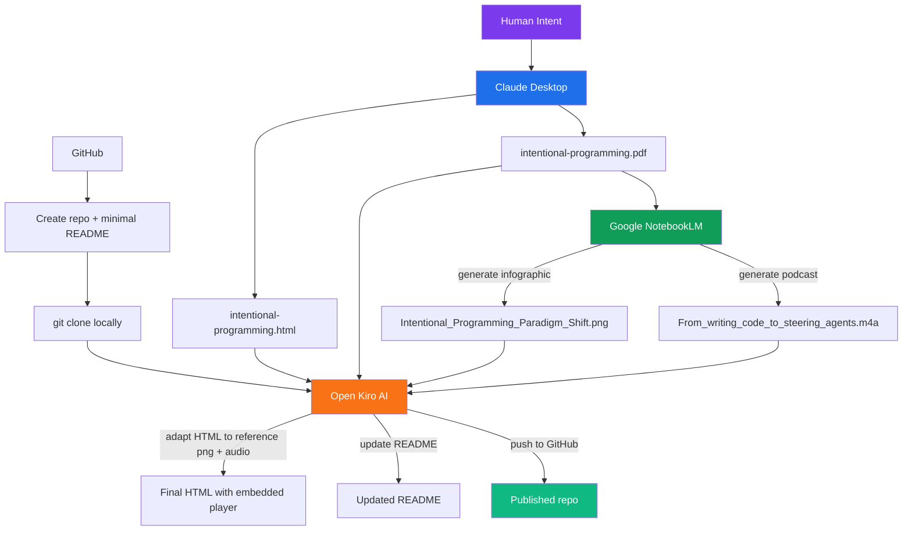

# Intentional Programming

A minimal exploration of the intentional programming paradigm — created entirely with AI tools, orchestrated by human intent.

**Author:** Dragos Boros  
**Date:** August 2025

## What's in here

| File | What it is |
|------|-----------|
| `intentional-programming.html` | The main article (open in a browser) |
| `intentional-programming.pdf` | PDF export of the article |
| `Intentional_Programming_Paradigm_Shift.png` | Infographic generated by NotebookLM |
| `From_writing_code_to_steering_agents.m4a` | Podcast generated by NotebookLM |
| `html2pdf.md` | Skill guide: convert HTML to PDF using headless Edge/Chrome |
| `changes.md` | Changelog of additions made via Kiro |

## Getting started

```bash
git clone https://github.com/dragosbo/intentional_programming.git
cd intentional_programming
```

Then open `intentional-programming.html` in your browser — that's the main entry point. From there:

1. **Read the article** — scroll through the paradigm history, quadrant chart, and worked examples.
2. **View the infographic** — it's embedded at the top of the page (the PNG).
3. **Listen to the podcast** — click the purple play button right below the infographic. No external player needed, it streams directly in the browser.

That's it. No build step, no dependencies, no server. Just a browser.

### Regenerate the PDF

If you edit the HTML and want a fresh PDF, run this from the repo folder (requires Edge or Chrome):

```cmd
"C:\Program Files (x86)\Microsoft\Edge\Application\msedge.exe" --headless --disable-gpu --print-to-pdf="intentional-programming.pdf" "file:///d:/work3/intentional_programming/intentional-programming.html"
```

See [`html2pdf.md`](html2pdf.md) for the full guide, flags, and cross-platform variants.

## How this was made



## Workflow step by step

1. **Claude Desktop** — authored the HTML article and generated the PDF. Claude handled the content, structure, and styling.
2. **NotebookLM** — I fed it the PDF and prompted it to generate two artifacts:
   - An infographic (the PNG)
   - A podcast episode, using this prompt:
     > *"Provide guidance for developers learning to shift from writing manual code to steering reasoning agents. Contrast intentional programming with procedural and object-oriented paradigms for better architectural clarity. Explain how the four-move loop turns simple chat into professional software engineering. Use the film director and orchestra analogies to simplify the agentic conductor role."*
3. **GitHub** — created the repo with a minimal README, then cloned locally.
4. **Kiro AI** — opened the local repo in Kiro and placed all artifacts in the folder. Asked Kiro to:
   - Adapt the HTML to correctly reference and render the PNG
   - Add an audio player for the podcast
   - Update this README
   - Push everything to GitHub

## License

This work is licensed under [CC BY 4.0](https://creativecommons.org/licenses/by/4.0/).

## Why this workflow matters

Claude Desktop is great for generating long-form content but can't easily wire up local file references or test them in context. Kiro bridges that gap — it sees the filesystem, edits in place, and verifies the result. The whole project is an instance of intentional programming: human intent in, AI-generated artifacts out, iteratively refined through dialogue.
